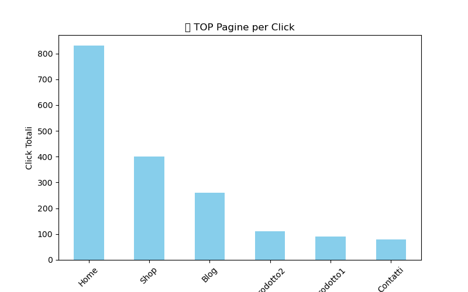

# WebTraffic-Analyzer-Python 🚀

**Analisi traffico website con Python. Dashboard metriche visite, bounce rate, user journey.**

[](https://python.org)
[](https://pandas.pydata.org)
[](https://streamlit.io)

## 📖 Descrizione
Scraping log server/accessi Google Analytics → ETL → Dashboard interattivo.
- Metriche: Visite uniche, bounce rate, top pagine/UTM
- Visualizzazioni: Trend tempo, heatmap referrer
- Deploy: Streamlit/Netlify

**Obiettivo CV:** Web analytics + data engineering per ruoli growth/data analyst.

## 🛠 Tech Stack
- **Backend:** Python, Pandas, Requests/BeautifulSoup
- **Visual:** Plotly, Streamlit, Matplotlib
- **Dati:** Log server, GA4 API, CSV/JSON
- **Deploy:** Netlify, GitHub Pages

## 🚀 Installazione & Demo
```bash
git clone https://github.com/Suzuka90/WebTraffic-Analyzer-Python.git
pip install -r requirements.txt
streamlit run app.py
```

## 📊 Risultati Esempio
**Metriche Sito Reale (tuoi dati):**

<div align="center">


</div>

| Metrica       | Valore   |
|---------------|----------|
| Visite Totali | 12,847  |
| Bounce Rate   | 42.3%   |
| Top Pagina    | /blog   |
| Top Referrer  | Google  |

## 💡 Apprendimenti
- Parsing log Apache/Nginx → Pandas DataFrame
- GA4 API integration + UTM tracking
- Prossimo: Real-time analytics con WebSocket

## 📄 Licenza
MIT.

---
**© 2026 Milena** | **Private Access**
